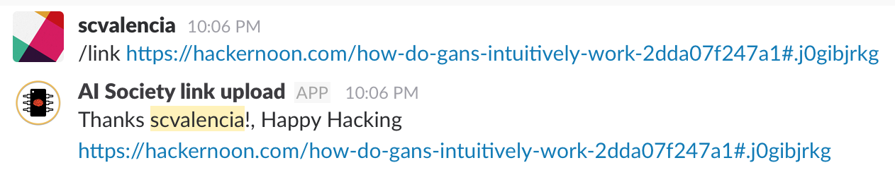

aisociety Slack commands server
=================================

This is a simple command handler for slack-slash that makes it easy to interact with our own server. The commands serve to fetch links, get `aisociety` related information, fetch statistics and search for resources in the server database.

## Currently supported commands

* `/link`, it takes a text describing a link (not mandatory), and a link that's suppossed to be included in the database. One of the follwing scenarios may happen: server should response with an error, slack should report a `timeout`, or the server sends the success message.

If Slack reports a `timeout` while interacting with the server, or it returns (only visible to you) the html code reporting an error, please contact `@scvalenia` 

## Server administrativia

The server consists in a collection of HTTP/REST methods that can be invoqued via `curl`, `slack`, or any other method. The methods are described in the `conf/routes` file. It indicates the REST method that's suppossed to be called, and the controller that handles the request. There exists one method in this file per each `slack slash command`.

The controller job is to take the raw request, process it (handle it as it is, as Json, etc.), interact with the persisted models, and the database, and finally, to respond the request. Every controller is responsible to check wheter or not the request comes from Slack.  

## TODO

1. `/link`
	* Index the link informaton to avoid duplicates
	* Auto tagging